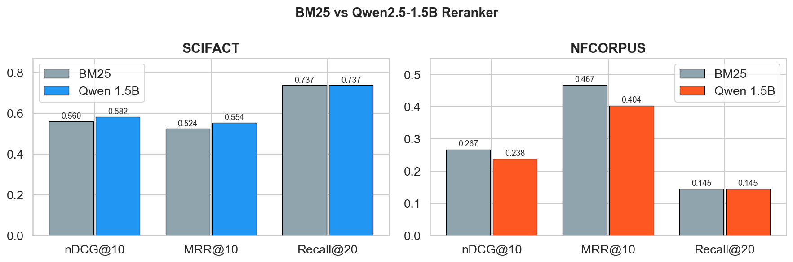
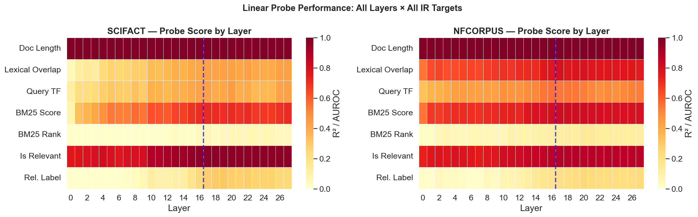
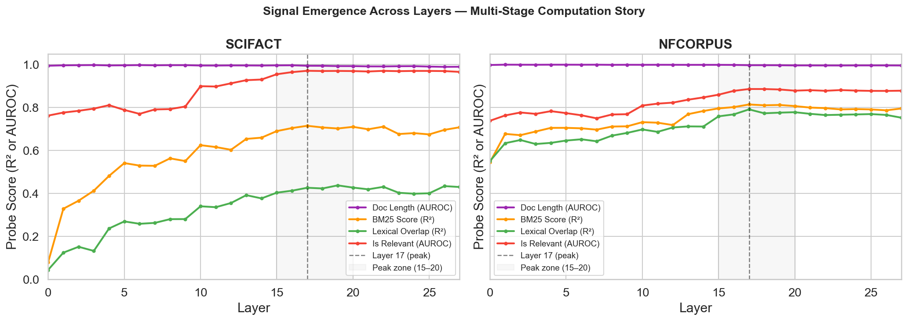
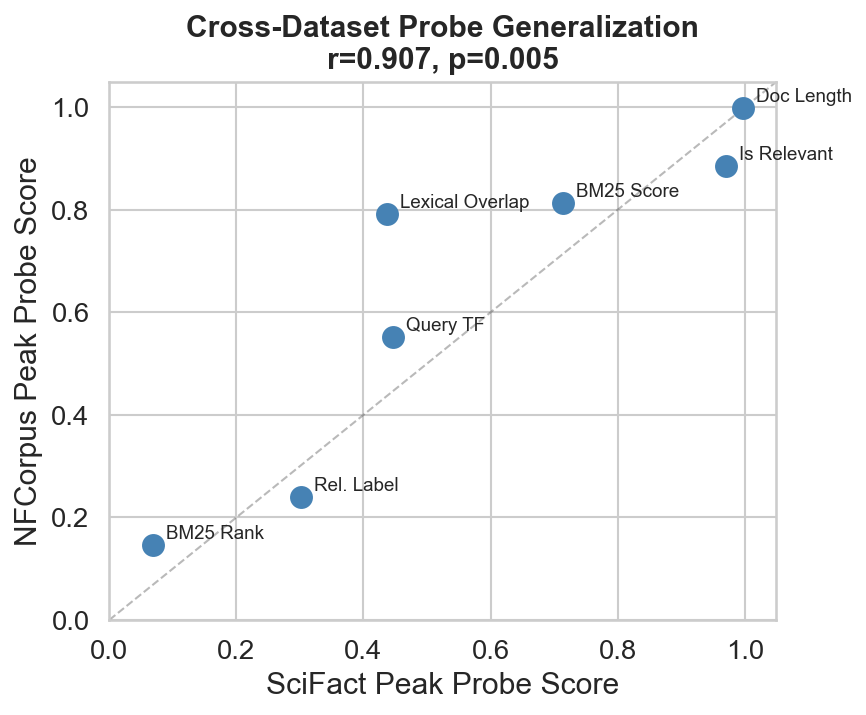
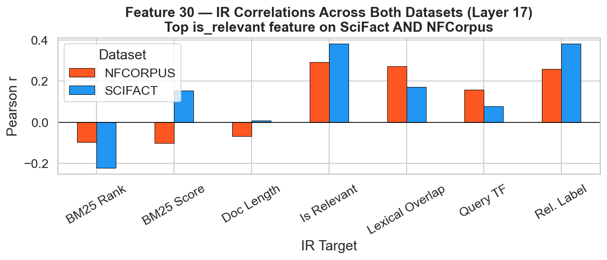
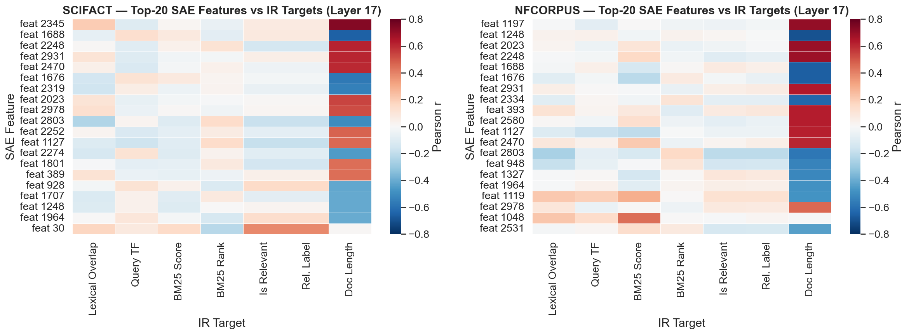
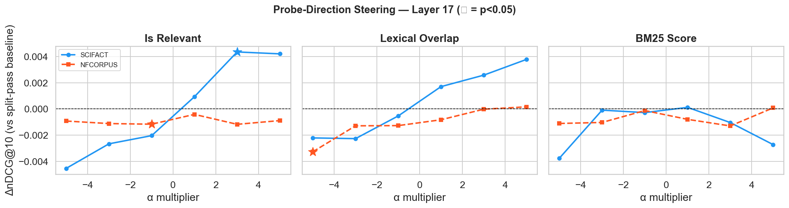
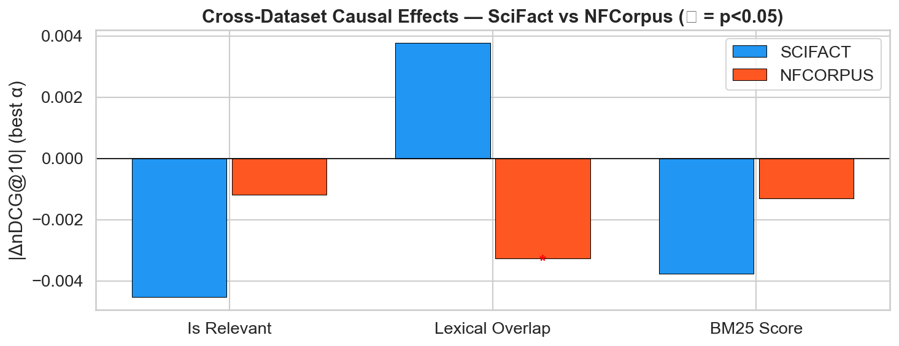
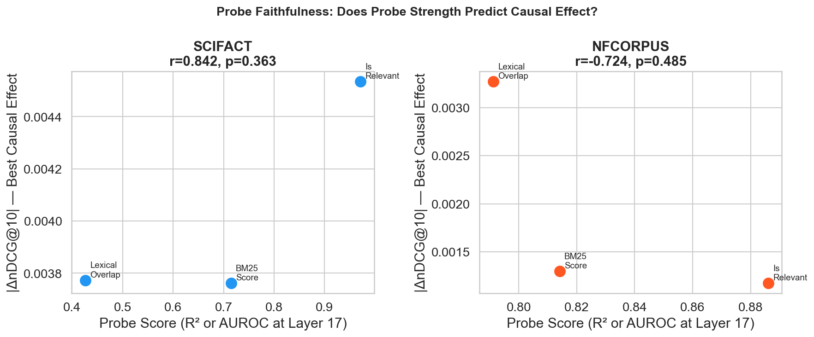

# Reverse-Engineering Relevance in LLM Rerankers
### Mechanistic Interpretability with Linear Probes and Causal Tests

**Model:** Qwen2.5-1.5B-Instruct (Apache-2.0) | **Datasets:** BEIR SciFact · BEIR NFCorpus (OOD)

> *What internal features do LLM rerankers use to judge relevance — and are those features causal?*

[](https://llm-mechanistic-interpretable-abc.streamlit.app/)

**🚀 Live Dashboard:** [https://llm-mechanistic-interpretable-abc.streamlit.app/](https://llm-mechanistic-interpretable-abc.streamlit.app/)

---

## Pipeline Overview

```
┌─────────────────────────────────────────────────────────────────────┐
│                        PROJECT PIPELINE                              │
└─────────────────────────────────────────────────────────────────────┘

  Phase 1-2                Phase 3-4               Phase 5-6
┌──────────┐  candidates ┌──────────┐  activations ┌──────────┐
│  BM25    │ ──────────► │  Qwen    │ ────────────► │  Linear  │
│Retrieval │  top-20     │ Reranker │  (28 layers)  │  Probes  │
└──────────┘             └──────────┘               └──────────┘
     │                        │                          │
  Baseline                 Scores                   Heatmaps
  nDCG/MRR              P(0)..P(3)               R² / AUROC
                                                  per layer
                                                       │
                    Phase 7                       Phase 8
                ┌──────────┐               ┌──────────────────┐
                │   SAE    │               │ Causal           │
                │ Training │               │ Interventions    │
                │layers    │               │ • Probe steering │
                │7, 17, 21 │               │ • SAE ablation   │
                └──────────┘               └──────────────────┘
                     │                          │
              Sparse features             ΔnDCG / ΔnDCG
              per IR target               paired t-test
```

---

## Quickstart — Run Everything from Scratch

### 1. Setup
*Est: 5 min*

```bash
git clone <repo>
cd "LLM Reranker"
python3 -m venv .venv && source .venv/bin/activate
pip install -e .
cp .env.example .env          # set PROJECT_ROOT if needed
```

### 2. Download Data
*Est: 5–10 min depending on connection*

```bash
python -m src.data.download --dataset scifact
python -m src.data.download --dataset nfcorpus
```

### 3. BM25 Baseline + Feature Engineering
*Est: ~5 min per dataset*

```bash
# BM25 retrieval — retrieves top-20 candidates per query using Okapi BM25 (k1=1.5, b=0.75)
python -m src.retrieval.evaluate_retrieval --dataset scifact
python -m src.retrieval.evaluate_retrieval --dataset nfcorpus

# Feature engineering — computes lexical overlap, BM25 score, doc length, query TF, etc.
python -m src.features.builder --dataset scifact
python -m src.features.builder --dataset nfcorpus
```

### 4. LLM Reranker
*Est: ~30 min per dataset (CPU/MPS) · ~5 min (GPU)*

```bash
# Single forward pass per pair — extracts P(0)..P(3) from lm_head at decision token
python -m src.reranking.evaluate_reranker --dataset scifact
python -m src.reranking.evaluate_reranker --dataset nfcorpus
```

### 5. Cache Activations (all 28 layers)
*Est: ~45 min per dataset (CPU/MPS) · ~10 min (GPU)*

```bash
# Extracts decision-token hidden states at all 28 layers for every query-doc pair
python -m src.activations.extractor --dataset scifact
python -m src.activations.extractor --dataset nfcorpus
```

### 6. Linear Probing
*Est: ~15 min per dataset*

```bash
# Trains 196 probes (28 layers × 7 targets) with 5-fold CV and bootstrap 95% CI
python -m src.probing.runner --dataset scifact
python -m src.probing.runner --dataset nfcorpus
```

### 7. SAE Training (layers 7, 17, 21)
*Est: ~25 min per layer per dataset (CPU/MPS)*

> **Why layers 7, 17, 21?** These cover three depth regions: early (surface features, ~25% depth), middle (confirmed peak for `is_relevant` at layer 17, ~60% depth), and late (post-peak consolidation, ~75% depth). Layer 17 was selected over the original plan of layer 14 based on probing results showing AUROC=0.97 for `is_relevant` peaks precisely at layer 17.

```bash
python -m src.sae.trainer --dataset scifact
python -m src.sae.trainer --dataset nfcorpus
```

### 8. Causal Interventions
*Est: ~6 hrs probe + ~4 hrs SAE per dataset (CPU/MPS) · ~1 hr total (GPU)*

> **Why layer 17?** Probing confirmed it as the peak relevance-encoding layer on both SciFact (AUROC=0.971) and NFCorpus (AUROC=0.886) — the single most informative intervention point.
>
> **Why targets `is_relevant`, `lexical_overlap`, `bm25_score`?** These represent three distinct signal types: binary relevance judgment, lexical surface matching, and retrieval score. Together they test whether each signal class is *causally* used, not just *encoded*.
>
> **Why SAE features 30, 2468, 746?** Feature 30 is the top `is_relevant` feature on both datasets (r=+0.382 SciFact, r=+0.292 NFCorpus) — enabling cross-dataset causal comparison. Feature 2468 is the second-best `is_relevant` feature on SciFact, testing whether causal effect scales with probe correlation. Feature 746 is top for `doc_length_bucket` (a structural, non-semantic signal) — testing whether non-relevance features have causal impact on ranking.

```bash
# SciFact — run probe then SAE sequentially overnight
source .venv/bin/activate && \
python -m src.interventions.runner --dataset scifact \
    --probe_only --probe_layers 17 \
    --probe_targets is_relevant lexical_overlap bm25_score \
    --alpha_multipliers -5 -3 -1 1 3 5 && \
python -m src.interventions.runner --dataset scifact \
    --sae_only --sae_layer 17 --sae_features 30 2468 746

# NFCorpus — same, run after SciFact completes
source .venv/bin/activate && \
python -m src.interventions.runner --dataset nfcorpus \
    --probe_only --probe_layers 17 \
    --probe_targets is_relevant lexical_overlap bm25_score \
    --alpha_multipliers -5 -3 -1 1 3 5 && \
python -m src.interventions.runner --dataset nfcorpus \
    --sae_only --sae_layer 17 --sae_features 30 2468 746
```

---

## Phase 1–2: Retrieval Baseline

BM25 (Okapi, k1=1.5, b=0.75) retrieves top-20 candidates per query.
Qwen2.5-1.5B-Instruct re-ranks using logit-based pointwise scoring — single forward pass extracting P(0)..P(3) from the lm_head at the decision token. Expected score E[s] = Σ i·P(i) used as the continuous ranking signal.

| Dataset | Method | nDCG@10 | MRR@10 | Recall@20 |
|---------|--------|---------|--------|-----------|
| SciFact | BM25 | 0.5597 | 0.5242 | 0.7370 |
| SciFact | Qwen2.5-1.5B | **0.5817** | **0.5537** | 0.7370 |
| SciFact | Δ | **+0.0220** | **+0.0295** | 0.0000 |
| NFCorpus | BM25 | **0.2666** | **0.4669** | 0.1446 |
| NFCorpus | Qwen2.5-1.5B | 0.2381 | 0.4039 | 0.1446 |
| NFCorpus | Δ | −0.0285 | −0.0630 | 0.0000 |

Reranker improves SciFact (+2.2pp nDCG) but degrades on OOD NFCorpus (−2.9pp), consistent with expected domain-shift degradation for a 1.5B-parameter model.



---

## Phase 3–4: Activation Extraction + Feature Engineering

Hidden states extracted at the decision token position (last input token) across all 28 layers for every query-document pair. Stored as float16 `.npy` caches (~2.6M token positions per dataset).

Seven IR-relevant probe targets computed per pair:

| Target | Type | Description |
|--------|------|-------------|
| `doc_length_bucket` | Logistic | Short / Medium / Long / VeryLong |
| `lexical_overlap` | Ridge | Shared query terms in document |
| `query_term_freq` | Ridge | Query term frequency in document |
| `bm25_score` | Ridge | BM25 relevance score |
| `bm25_rank` | Ridge | BM25 ordinal rank (1–20) |
| `is_relevant` | Logistic | Binary ground-truth relevance |
| `relevance_label` | Ridge | Graded relevance label |

---

## Phase 5–6: Linear Probing — Layerwise Signal Emergence

Ridge regression (continuous targets) and Logistic regression (binary/bucketed) probes trained at every layer × every target. 196 probes per dataset.

**Key finding: Layer 17 is the dominant peak for all IR-relevant signals.**

| Target | Metric | SciFact Peak | NFCorpus Peak | Peak Layer |
|--------|--------|-------------|---------------|-----------|
| Doc Length | AUROC | 0.9976 | 0.9994 | 3 |
| **Is Relevant** | AUROC | **0.9709** | **0.8861** | **17** |
| BM25 Score | R² | 0.7147 | 0.8141 | 17 |
| Lexical Overlap | R² | 0.4262 | 0.7912 | 17–19 |
| Query TF | R² | 0.4466 | 0.5516 | 20 |
| Relevance Label | R² | 0.3022 | 0.2392 | 19–20 |
| BM25 Rank | R² | 0.0694 | 0.1459 | 17 |

**Stage story across layers:**
- Layers 0–4: Surface features (doc length reaches AUROC=0.99 by layer 3)
- Layers 5–14: Gradual build-up of lexical and BM25 signals
- Layers 15–20: Peak — relevance assessment zone (is_relevant AUROC=0.97 at layer 17)
- Layers 21–27: Slight decay as model shifts to output formatting





**Cross-dataset generalization:** Layer 17 peak is consistent across SciFact and NFCorpus, confirming it is a stable property of Qwen2.5-1.5B's relevance processing.



---

## Phase 7: Sparse Autoencoder (SAE) Analysis

TopK SAEs trained on residual-stream activations at layers 7, 17, 21 using all token positions (~2.6M vectors per dataset). Architecture: `input_dim=1536`, TopK k=64, expansion factor 2–4x.

| Dataset | Layer | Hidden Dim | Val MSE |
|---------|-------|-----------|---------|
| SciFact | 7 | 6144 | 0.1388 |
| SciFact | **17** | **3072** | **0.2813** |
| SciFact | 21 | 3072 | 0.6576 |
| NFCorpus | 7 | 6144 | 0.1120 |
| NFCorpus | **17** | **3072** | **0.2498** |
| NFCorpus | 21 | 3072 | 0.5940 |

Higher val MSE at later layers reflects richer, less easily reconstructable representations — expected as the model integrates more complex signals.

**Top SAE feature per IR target at layer 17:**

| IR Target | SciFact Feature | r | NFCorpus Feature | r |
|-----------|----------------|---|-----------------|---|
| **Is Relevant** | **feat 30** | **+0.382** | **feat 30** | **+0.292** |
| BM25 Score | feat 2166 | −0.292 | feat 1048 | +0.447 |
| Lexical Overlap | feat 746 | −0.241 | feat 2252 | −0.276 |
| Doc Length | feat 2345 | +0.734 | feat 1197 | +0.705 |

**Headline finding: Feature 30 is the top `is_relevant` feature on both SciFact AND NFCorpus** — strong cross-dataset mechanistic consistency.





---

## Phase 8: Causal Interventions

**Methodology:** Split forward pass at layer 17 — run layers 0–17 once per batch, then apply perturbation and run layers 18–27 for each condition. All comparisons made against an in-pass baseline (same pipeline, no perturbation) to ensure fair measurement.

**Two intervention types:**
1. **Probe-direction steering** — add `α × (w/‖w‖)` to the decision token hidden state at layer 17
2. **SAE feature steering** — ablate or amplify specific SAE feature directions at layer 17

### Results: SciFact

| Experiment | Target / Feature | α | ΔnDCG@10 | p-value | |
|-----------|-----------------|---|----------|---------|---|
| Probe | `is_relevant` | +3 | +0.0043 | **0.048** | ✅ significant |
| Probe | `lexical_overlap` | +5 | +0.0038 | 0.172 | trend |
| Probe | `bm25_score` | any | ~0.000 | >0.14 | null |
| SAE ablate | feat 30 (is_relevant) | — | −0.0038 | **0.046** | ✅ significant |
| SAE amplify | feat 30 | +3 | +0.0014 | 0.520 | — |

### Results: NFCorpus (OOD)

| Experiment | Target / Feature | α | ΔnDCG@10 | p-value | |
|-----------|-----------------|---|----------|---------|---|
| Probe | `lexical_overlap` | −5 | −0.0033 | **0.028** | ✅ significant |
| Probe | `is_relevant` | −1 | −0.0012 | **0.038** | ✅ significant |
| Probe | `bm25_score` | any | ~0.000 | >0.15 | null |
| SAE | feat 30, 2468, 746 | any | <0.001 | >0.13 | null |





### Key Findings

**1. Relevance direction is causally used on SciFact (p=0.048)**
Steering the `is_relevant` probe direction at layer 17 produces a monotonic dose-response: negative α degrades ranking, positive α improves it. One statistically significant condition confirms the direction.

**2. SAE Feature 30 ablation is causally significant (p=0.046)**
Removing feature 30's contribution to the residual stream hurts nDCG@10 on SciFact. This provides independent confirmation from a different method: the relevance-encoding SAE feature is causally used for ranking decisions.

**3. OOD signal shift — SciFact vs NFCorpus**
On NFCorpus (biomedical, OOD), `lexical_overlap` becomes the dominant causal signal (p=0.028), not `is_relevant`. This is consistent with the probing finding that NFCorpus has stronger lexical_overlap R²=0.79 vs SciFact's 0.44. The model relies more on lexical matching when shifted to a new domain.

**4. bm25_score is consistently non-causal (both datasets)**
Despite high probe strength (R²=0.71 on SciFact), the `bm25_score` probe direction has no significant causal effect on ranking in either dataset. This is a clear **probe faithfulness failure**: linear decodability does not imply causal use.

**5. Feature 30 causality is SciFact-specific**
Feature 30 is the top `is_relevant` feature on both datasets (r=0.382 SciFact, r=0.292 NFCorpus), but its causal effect does not transfer OOD. Its role appears domain-specific.



---

## Repository Structure

```
LLM Reranker/
├── configs/                   # YAML configs for all phases
│   ├── reranker.yaml
│   ├── probing.yaml
│   ├── sae.yaml
│   └── interventions.yaml
├── src/
│   ├── data/                  # Download, load, pair builder
│   ├── retrieval/             # BM25 index + evaluation
│   ├── reranking/             # Qwen inference, prompt builder
│   ├── activations/           # Hook-based activation extraction
│   ├── features/              # IR feature computation
│   ├── probing/               # Linear probe training + bootstrap CI
│   ├── sae/                   # TopK SAE model, trainer, analyzer
│   ├── interventions/         # Phase 8: fast split-pass causal experiments
│   └── evaluation/            # nDCG@10, MRR@10, Recall@20
├── notebooks/
│   ├── 01_data_exploration.ipynb
│   ├── 02_bm25_baseline.ipynb
│   ├── 03_reranker_evaluation.ipynb
│   ├── 04_activation_inspection.ipynb
│   ├── 05_feature_inspection.ipynb
│   ├── 06_probing_results.ipynb
│   ├── 06b_midproject_checkpoint.ipynb
│   ├── 07_sae_analysis.ipynb
│   ├── 08_interventions.ipynb  # Phase 8 deep-dive (both datasets)
│   └── 09_final_analysis.ipynb # Full analysis + all presentation figures
├── data/
│   ├── raw/                   # BEIR datasets (scifact, nfcorpus)
│   ├── interim/               # BM25 pairs, features
│   ├── processed/             # Reranker scores, probe results + weights
│   └── caches/                # Activation caches, SAE activations
└── outputs/
    ├── midproject/            # Checkpoint figures + report
    └── final/
        ├── figures/           # All presentation figures (fig1–fig12)
        ├── tables/            # CSV tables (retrieval, probes, SAE, causal)
        ├── sae_checkpoints/   # Trained SAE weights (layers 7, 17, 21)
        ├── sae_analysis/      # IR correlation parquets + top examples
        └── interventions/     # Phase 8 results (scifact + nfcorpus)
```

---

## Requirements

```
torch>=2.1.0
transformers>=4.40.0
datasets>=2.18.0
accelerate>=0.27.0
beir>=2.0.0
rank_bm25>=0.2.2
numpy>=1.26.0
scipy>=1.12.0
scikit-learn>=1.4.0
pandas>=2.2.0
matplotlib
seaborn
jupyter
```

Install: `pip install -e .`

---

## Research Questions Answered

| RQ | Question | Answer |
|----|----------|--------|
| RQ1 | Which IR signals are linearly decodable, in which layers? | All 7 targets decodable; layer 17 is the peak for relevance (AUROC=0.97). Progression: surface features (layers 0–4) → lexical/BM25 (5–14) → relevance peak (15–20) → output formatting (21–27) |
| RQ2 | Are those signals causally used? | Partially. `is_relevant` direction is causal on SciFact (p=0.048). `bm25_score` (R²=0.71) is not causal — clear probe faithfulness failure. |
| RQ3 | Does causality transfer OOD? | Signal shifts: `is_relevant` causal on SciFact → `lexical_overlap` causal on NFCorpus. Feature 30 causality is domain-specific. |
